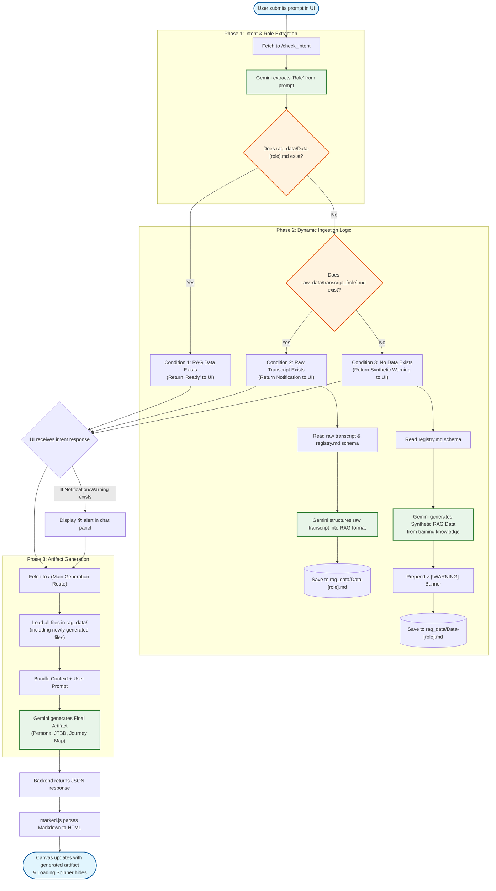

# Huxley Copilot Workflow Diagram

This diagram maps the application's lifecycle from the moment a user submits a prompt, through the dynamic intent checking and data ingestion phases, all the way to the final artifact rendering on the canvas.

### Flow Breakdown
1. **User Input:** The UI prevents a page reload, shows the loading spinner, and sends the prompt to the backend.
2. **Phase 1 (Intent Check):** The backend quickly uses Gemini to figure out *who* the user is asking about.
3. **Phase 2 (Dynamic Logic):** 
   - **Condition 1:** If the structured RAG file is already there, the backend does nothing extra.
   - **Condition 2:** If it's missing but a raw transcript is found, it automatically structures it using the `registry.md` schema.
   - **Condition 3:** If neither exists, it synthesizes realistic data from its training memory and clearly stamps it with a warning banner.
4. **Phase 3 (Fulfillment):** The application bundles whatever RAG data was found (or newly created), passes it to Gemini along with your original prompt, and generates the final output for the canvas.
